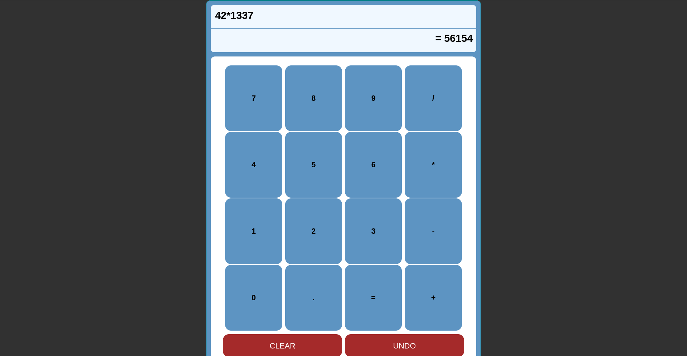
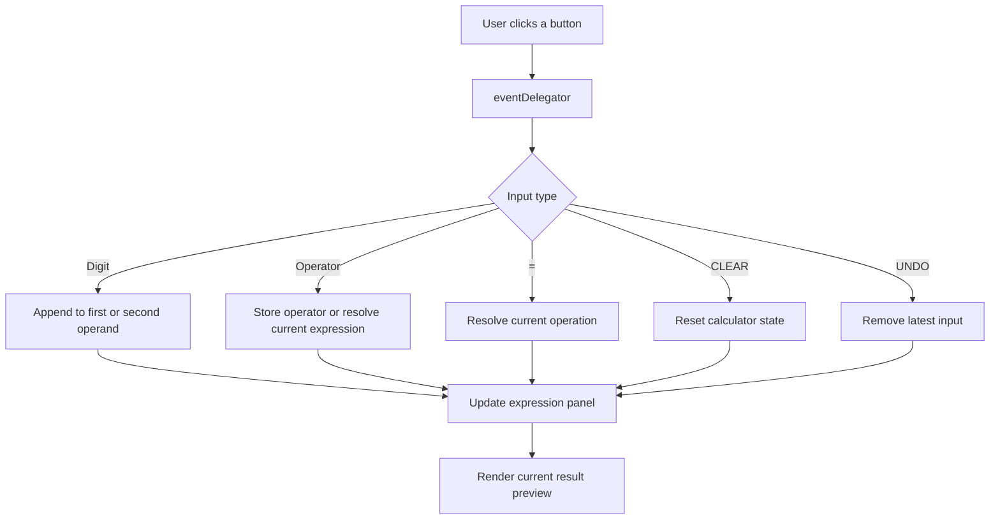

# Calculator

A responsive browser calculator built with vanilla HTML, CSS, and JavaScript. This project focuses on translating a simple interface into a small but real state-management problem: capturing user input, updating the UI in sync, resolving arithmetic safely, and keeping the logic understandable without relying on frameworks.

[Live Demo](https://smailoujaoura.github.io/odin_calculator/)

## Preview



## Project Summary

This calculator was built as part of a foundational front-end learning track and is a strong example of turning requirements into a working interactive product. Even though the interface looks simple, the implementation touches several practical engineering ideas:

- DOM querying and event handling
- State modeling for user input
- Incremental UI rendering
- Error handling for invalid math cases
- Responsive layout decisions
- Scope control and iterative delivery

The app currently supports multi-digit integer input, chained operations, a live expression display, a live result preview, undo, clear, and division-by-zero protection.

## Why This Project Is Valuable

From a recruiter or reviewer perspective, this project shows more than basic styling. It demonstrates the ability to:

- break a problem into smaller functions and responsibilities
- model application state with plain JavaScript objects
- use event delegation instead of repetitive listeners
- ship a complete feature before expanding scope
- document limitations and define the next iteration clearly

## Features

- Multi-digit number entry
- Addition, subtraction, multiplication, and division
- Live expression panel
- Live result preview while entering the second operand
- `CLEAR` action to reset the calculator state
- `UNDO` action to remove the latest input
- Division-by-zero guard
- Responsive centered layout suitable for desktop and smaller screens

## Demo

- Live site: [smailoujaoura.github.io/odin_calculator](https://smailoujaoura.github.io/odin_calculator/)
- Local run: open `index.html` in a browser

## Logic Flow

The calculator behaves more like a handheld calculator than a full math parser. Operations are resolved step by step as input is entered, rather than using algebraic precedence rules.



## Implementation Notes

The project centers around a small shared state object:

```js
const operation = {
  first: null,
  second: null,
  operator: null,
};
```

This is a good early example of managing UI through state instead of scattered DOM-only logic. User input is funneled through one container listener, which keeps the code simpler and scales better than attaching a separate listener to every button.

```js
function eventDelegator(e) {
  let targetClass = e.target.classList[1];

  if (targetClass.startsWith("digit-")) {
    makeOperation(parseInt(targetClass.split("-")[1]));
  } else if (targetClass.endsWith("-clear")) {
    clearInputs();
  } else if (targetClass.endsWith("-undo")) {
    undoInput();
  } else {
    makeOperation(OPERATORS[targetClass.split("-")[1]]);
  }
}
```

## What Was Learned

- How to translate UI requirements into a state-driven implementation
- How event delegation reduces repeated code and simplifies DOM interaction
- How quickly edge cases appear in input-heavy interfaces
- Why keeping display logic synchronized with application state matters
- Why shipping a stable base version first is often better than chasing every extra feature immediately

## Challenges

- Keeping the expression panel and result panel consistent after every interaction
- Handling chained operations without introducing confusing state bugs
- Supporting `UNDO` across operands and operators cleanly
- Preventing invalid states like division by zero
- Deciding where to stop for the first version instead of overbuilding too early

## Optimization Decisions

The project is intentionally small, but there are still meaningful implementation choices worth highlighting:

- Cached DOM references reduce repeated lookups
- Event delegation uses a single listener for the full keypad
- Operator mapping centralizes token handling
- The app previews results before `=` is pressed, improving feedback
- Static deployment on GitHub Pages keeps delivery lightweight and dependency-free

## Academic Value

This project has strong academic value because it reinforces several core software engineering concepts in a compact format:

- state transitions and control flow
- event-driven programming
- user input parsing
- edge-case handling
- separation of concerns between calculation logic and rendering
- iterative development with visible next steps

It is also a good stepping stone toward more advanced topics such as keyboard accessibility, testing, object-oriented refactoring, and expression parsing.

## Known Limitations

- Decimal support is planned but not implemented yet
- Keyboard support is planned but not implemented yet
- The current arithmetic logic uses integer parsing
- Operations are resolved sequentially rather than with mathematical precedence
- There is no automated test suite yet

## Future Improvements

- Add keyboard support for a more complete calculator experience
- Support decimal arithmetic safely
- Refactor rendering into one dedicated display-update function
- Improve accessibility semantics and focus handling
- Add tests around operation chaining, undo, clear, and edge cases

## Key Files

```text
.
|-- README.md
|-- index.html
|-- style.css
|-- script.js
`-- docs/
    `-- calculator-preview.png
```

## Closing Note

This project is a good example of how a seemingly simple interface can still demonstrate solid engineering thinking. It shows requirement analysis, UI state modeling, edge-case awareness, incremental delivery, and the discipline to identify what belongs in version one versus the next iteration.
